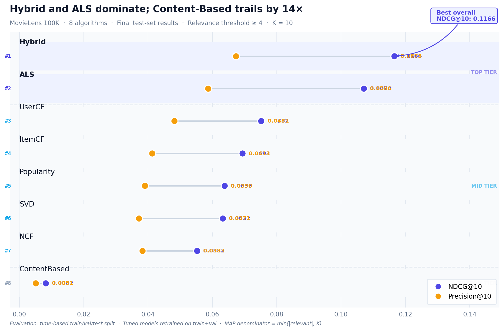
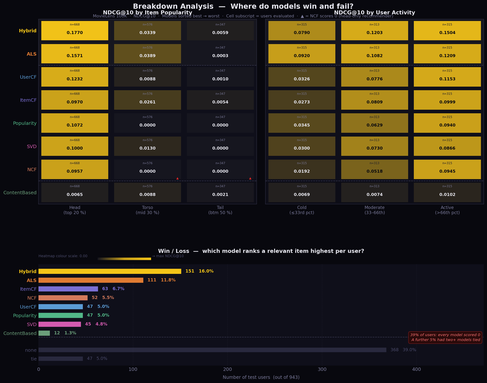

# Recommendation Algorithm Benchmark — MovieLens 100K

A rigorous comparison of 8 recommendation algorithms under a single shared
evaluation protocol. The goal is fair comparison, not squeezing the best score
out of any one model.

---

## Results

Final test-set results (models retrained on train + val with tuned hyperparameters):

| Rank | Model | NDCG@10 | Precision@10 | Recall@10 | Train time |
|------|-------|---------|-------------|----------|------------|
| 1 | **Hybrid** (LightFM WARP) | **0.1166** | 0.0673 | 0.1371 | 17s |
| 2 | **ALS** (implicit) | 0.1070 | 0.0586 | 0.1344 | 0.7s |
| 3 | UserCF | 0.0752 | 0.0481 | 0.0808 | 0.1s |
| 4 | ItemCF | 0.0693 | 0.0413 | 0.0751 | 0.3s |
| 5 | Popularity | 0.0638 | 0.0390 | 0.0727 | 0.07s |
| 6 | SVD | 0.0632 | 0.0371 | 0.0707 | 0.4s |
| 7 | NCF (NeuMF) | 0.0552 | 0.0383 | 0.0566 | 21s |
| 8 | ContentBased | 0.0082 | 0.0051 | 0.0123 | 0.3s |



---

## Key Findings

1. **Hybrid wins clearly** — WARP loss directly optimises ranking, and genre
   item features add signal that pure collaborative methods lack.
2. **ALS is the best pure CF model** — implicit-feedback matrix factorisation
   handles 7.8 % matrix density far better than neighbourhood methods.
3. **NCF underperforms** despite being the most complex model. MovieLens 100K
   is too small; the tuner found the optimum at all lower bounds, indicating
   the model overfits at any reasonable capacity.
4. **Every model fails on long-tail items** — tail NDCG@10 is near zero across
   the board. All models learn to recommend popular items.
5. **39 % of test users are completely unserved** — no model found a relevant
   item in the top 10. This ceiling matters more than model ranking differences.

---

## Project Structure

```
.
├── src/
│   ├── data_prep/
│   │   ├── loader.py          # load, filter, split, build interaction matrices
│   │   └── eda.py             # exploratory data analysis → results/plots/eda_overview.png
│   ├── models/
│   │   ├── base.py            # BaseRecommender interface
│   │   ├── popularity.py      # Bayesian mean-rating baseline
│   │   ├── content_based.py   # 19-genre binary vectors, L2-normalised
│   │   ├── user_cf.py         # mean-centred cosine UserCF (Herlocker/Koren)
│   │   ├── item_cf.py         # mean-centred ItemCF
│   │   ├── svd.py             # truncated SVD (scipy svds)
│   │   ├── als.py             # implicit ALS (implicit lib)
│   │   ├── ncf.py             # NeuMF GMF+MLP (PyTorch)
│   │   └── hybrid.py          # LightFM WARP + genre item features
│   ├── evaluation/
│   │   ├── evaluator.py       # benchmark() / evaluate() entry points
│   │   └── metrics.py         # NDCG, Precision, Recall, MAP, RMSE, MAE
│   ├── tuning/
│   │   ├── spaces.py          # Bayesian search spaces per model
│   │   └── tuner.py           # scikit-optimize GP tuner
│   ├── analysis/
│   │   └── breakdown.py       # popularity-bucket / user-tier / win-loss analyses
│   └── visualization/
│       ├── benchmark_plots.py # dumbbell chart → results/plots/benchmark_comparison.png
│       └── breakdown_plots.py # 3-panel breakdown → results/plots/breakdown_overview.png
│
├── results/
│   ├── benchmark_results.csv  # final test-set metrics for all 8 models
│   ├── plots/                 # all generated figures
│   ├── analysis/              # breakdown CSVs (popularity, activity, win-loss)
│   └── tuning/
│       └── best_params.json   # tuned hyperparameters for Week 3 models
│
├── run_final_benchmark.py     # retrain on train+val → evaluate on test
├── run_breakdown_analysis.py  # fit models → run 3 breakdown analyses
├── generate_report.py         # generate report.ipynb
├── report.ipynb               # fully executed summary notebook
└── requirements.txt
```

---

## Quickstart

```bash
# 1. Install dependencies
pip install -r requirements.txt

# 2. Download MovieLens 100K into data/raw/ml-100k/
#    https://grouplens.org/datasets/movielens/100k/

# 3. Run the final benchmark (train+val → test)
python3 run_final_benchmark.py

# 4. Run breakdown analysis
python3 run_breakdown_analysis.py

# 5. Regenerate the summary notebook
python3 generate_report.py
jupyter notebook report.ipynb
```

---

## Evaluation Protocol

| Property | Value |
|----------|-------|
| Split strategy | Time-based per user |
| Train / val / test | ~80 % / 10 % / 10 % (per user) |
| Relevance threshold | Rating ≥ 4 |
| Primary metric | NDCG@10 |
| K values | 5, 10 |
| MAP denominator | min(\|relevant\|, K) |
| Users with no relevant test items | Scored 0 (not excluded) |
| Final training data | Train + val combined |
| Tuning target | Val NDCG@10 (test never seen) |

The id universe (943 users × 1,349 items) is built from all filtered ratings
**before** splitting. Every matrix and every split shares the same row/column
index space — models that look up val/test users or items never encounter an
out-of-bounds index.

---

## Adding a New Model

1. Create `src/models/<name>.py`, subclass `BaseRecommender`.
2. Implement `fit(self, train, **kwargs)` and `recommend(self, user_id, n, exclude_seen)`.
3. Register it in `src/models/__init__.py` under `MODELS`.
4. If the model needs the sparse matrix or metadata, declare keyword-only args in `fit()`:

```python
def fit(self, train, *, movies=None, train_matrix=None,
        user_id_to_idx=None, item_id_to_idx=None, **kwargs):
```

---

## Breakdown Analysis

Three post-hoc analyses beyond aggregate NDCG@10:



- **Item popularity buckets** — NDCG@10 for head (top 20 %), torso (mid 30 %),
  and tail (bottom 50 %) items. Every model degrades sharply toward the tail;
  NCF scores exactly 0 on torso and tail.
- **User activity tiers** — NDCG@10 for cold (≤33rd pct), moderate, and active
  users. ALS degrades most gracefully on cold users; UserCF is most sensitive.
- **Win / loss** — which model achieves the highest per-user NDCG@10? Hybrid
  wins for 16 % of users, ALS for 12 %; 39 % of users are unserved by all models.

---

## Hyperparameter Tuning

Week 3 models (SVD, ALS, NCF, Hybrid) were tuned with Bayesian optimisation
(`scikit-optimize`) maximising val NDCG@10. `random_state=42` is fixed throughout.

| Model | Notable boundary finding |
|-------|--------------------------|
| SVD | `n_factors=45` — converged well inside [10, 150] |
| ALS | `regularization=8.3` — hit upper ceiling twice; needs heavy regularisation |
| NCF | All params at lower bounds — overfits at any reasonable capacity on this dataset |
| Hybrid | `no_components=100`, `epochs=78` — both at upper bounds; more would help |

Tuned parameters are stored in `results/tuning/best_params.json`.
